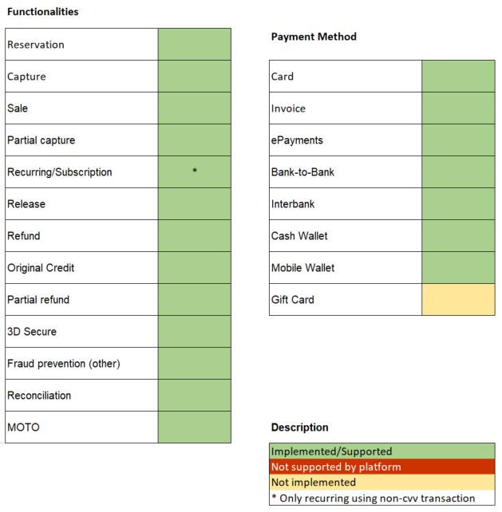

# AltaPay for NetSuite
Through the partnership of AltaPay and NetSuite, we have made it much easier for you as merchant/developer to receive secure payments in your webshop. AltaPay is fully integrated with NetSuite platform via a bundle. All you have to do is to install the bundle, which will only take a few minutes to complete.

## Supported functionalities

## Changelog

See [Changelog](CHANGELOG.md) for all the release notes.

## License

Distributed under the MIT License. See [LICENSE](LICENSE) for more information.

## Documentation

For more details please see [AltaPay docs](https://documentation.altapay.com/)

## Contact
Feel free to contact our support team (support@altapay.com) if you need any assistance.
